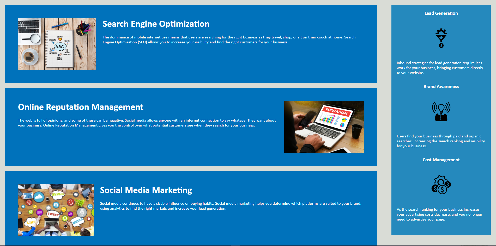

## Welcome to my First Challenge!

I am Michael Mizell, a novice computer programmer who has had a couple years of programming behind my belt. I have worked with primarily C++ in my journey through programming but it hasn't stopped there. I have also worked on some Java. I hope to show greateness when it comes to my programming knowledge and skills!

## Challenge

In this first challenge there was the need to make the code more semantic, to add descriptions to photos for people with visual impairments, and to make sure things like the title were cleaned up.
We also needed to be able to deploy the github website to show off the project properly.

### Goals

- I hope to accomplish a good understanding of the basic semantic terms that can be used in html
- Learn how to give a clear description of photos
- Read and understand the structure of any basic website when looking at its html
- Work with github more to understand how to use it to its full potential

### Final Thoughts

Working with html and css is fun. I can't wait to get into JavaScript and learning how to implement that into a website. The possibilities are endless with JavaScript.

## Project Preview
[GitHub Deployed Page](https://mikeymizell.github.io/Horiseon-Marketing/)

### Contact Info

[Email Here](mailto:mikey.mizell.2016@gmail.com) | 
[LinkedIn Profile](https://www.linkedin.com/in/michael-mizell-ii-803861141/)
